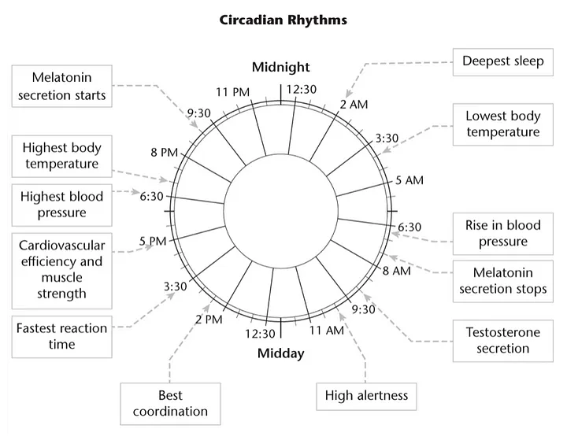

# "Sleep"_After reading chapter one, you adjust sleeping schedule spontaneously.


## OUTLINE
- [What is circadian rhythms?](#what-is-circadian-rhythms)
- [How important is human body's circadian rhythms?](#how-important-is-human-bodys-circadian-rhythms)
- [Tips to follow body rhythms for better performance.](#tips-to-follow-body-rhythms-for-better-performance)
    - [1. Don't use or decrease blue light before you sleep.](#1-dont-use-or-decrease-blue-light-before-you-sleep)
    - [2. Attach to nature light right after you sleep.](#2-attach-to-nature-light-right-after-you-sleep)
    - [3. Wake up earlier to have enough time to pee & have breakfast.](#3-wake-up-earlier-to-have-enough-time-to-pee--have-breakfast)
    - [4. Sleep on the correct time.](#4-sleep-on-the-correct-time)

## What is circadian rhythms?
Circadian rhythms is a human body's pattern which is inherited from our ancestor.  

First, our ancestor live in an island where do not have artificial light. The only illumination they use is fire. Second, they empty their bladder first and leisurely have their breakfast when they wake up. In addition, they expose to natural sun light. Last but not least, human start to secrete melatonin, which help us feel sleepy, around 9:00 p.m. and stop around 9:00 a.m..  


`Excerpt From: Littlehales, Nick. "Sleep." Apple Books.`

## How important is human body's circadian rhythms?
Now, think about when artificial light is invented. The answer is nineteenth century. This means human body follows nature rhythms for billion years and artificial light appears less than 200 years.  

**Our body still used to nature rhythms.** We should follow it to improve our life.  

## Tips to follow body rhythms for better performance.

### 1. **Don't use or decrease blue light before you sleep.**

For our ancestor, the sunset in evening(their eyes pause to absorb blue-light in evening) and they only use fire for illumination(which don't include blue-light). Moreover, we already know blue light will influence our melatonin secretion.

### 2. **Attach to nature light right after you sleep.**  

Nature light can bring you blue light which can wake up your body and decrease melatonin secretion.

### 3. **Wake up earlier to have enough time to pee & have breakfast.**  

Our ancestor won't rush in the morning. **Sleep quality is all about what we do from the point of waking.**

### 4. **Sleep on the correct time.**  

Human start to secrete melatonin, which help us feel sleepy and get better sleep, around 9:00 p.m. and stop around 9:00 a.m.. If you sleep at 5AM you are forcing yourself.  

```
NOTE : A usual misunderstand about blue light.  
Blue light is not a bad material all the time. Actually, daylight is full of blue light, and it is good during the day. The damage about blue light happened when we use it at wrong time.
```

Reference from my own artical on medium: [“Sleep”_After reading chapter one, you adjust sleeping schedule spontaneously.](https://medium.com/@LiuIan/sleep-after-reading-chapter-one-you-adjust-sleeping-schedule-spontaneously-d26da346c029)