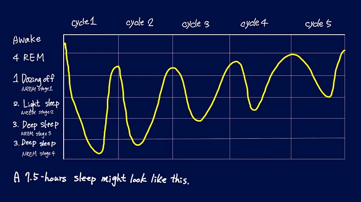

"Sleep"_What you experience during the night.
Reading notes

OUTLINE
Four different states in a 90 minutes cycle.
    1. Dozing off - non REM stage 1
    2. Light sleep - non REM stage 2
    3. Deep sleep - non REM stage 3(and 4)
    4. Rapid eye movement(REM)
Something special about this process.
A whole night sleep is divided into couples of same cycles (though there is a little different between these cycles). During each cycle we experience 4 different states. In addition, every cycle continued for about 90 minutes.
Four different states in a 90 minutes cycle.
1. Dozing off - non REM stage 1
In this state you are between asleep and awake.
You are waked up by some soft voice very easily.
There is a situation that you feel you are falling down and then wake up suddenly, it happened at this state.

2. Light sleep - non REM stage 2
Our heart rate slows down and our body temperature drops.
Only louder voice can wake you up this time.
We spend most of the time in this state.
We can consolidate information and improve motor-skill in this state.

3. Deep sleep - non REM stage 3(and 4)
It is really hard to wake you up in this state.
Our body release the highest proportion of growth hormone which can improve our performance.
Our body tend to spend around 20% of time in this state.

4. Rapid eye movement(REM)
Our body is temporary paralysed and dreaming happened at this state.
It is proved that REM is relative to creativity.
After we experience this state we go back to state 1, dozing off, and repeat the process.

Something special about this process.
Actually, each state has different ratio in each cycle in one night sleep. Deep sleep has higher ratio in earlier cycle and REM has higher ratio in later cycle.
However, REM is more important to us. If we sleep less than we used to, our body tent to skip the earlier cycle and experience the higher REM ratio cycle directly.
Announcement : I write this article after I read the book "Sleep - Littlehales, Nick". I learn most of the concept from the book, and I organize those and illustrate in my own word. All I want is to share the valuable knowledge to more people!