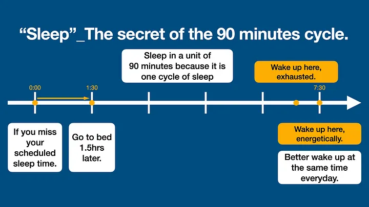

"Sleep"_The secret of the 90 minutes cycle.
Reading notes
OUTLINE

The secret of the 90 minutes cycle.
Some mindsets let you feel stress-free to sleep.
Methods to improve your life according to 90 minutes cycle.
  1. Wake up at exactly the same time.
  2. It is not necessary to sleep at the same time.
  3. Decide your bed time push back from your wake up time in a unit of 90 minutes.
Some tips to follow these sleep time methods.
Key points of this article.The secret of the 90 minutes cycle.
As we mentioned before(I will provide the link below.), a whole night sleep is divided into couples of same cycles. A 90 minutes cycle is divided into four different states. Each state helps us to complete something relative to our brain. For instance, creativity, long term memory…etc.
You may have an experience that you sleep for a long time but still, feeling tired when you wake up. The thing is, sleep in the correct length of time is much more important than sleep for a longer time. Actually, the best moment to wake up is around or a little bit after the end of a 90 minutes cycle.
However, the first thing to let us get a good sleep is to feel stress-free to sleep.
Some mindsets let you feel stress-free to sleep.
The author wrote this book to help people getting a better sleep quality, not only explained the theory. As the result, the author empathized the flexibility we need to keep to approach the reality. Base on this concept, the author suggested that we should measure total sleep amount in the unit of a week, not a single day. It's okay to have a bad sleep quality for one single night.
Next time when you have a tough time to fall asleep, keep in mind the sleep quality is measured base on a week, not a day. If you do not feel stressful to fall asleep right on the time, it may become easier for you to fall asleep.
Methods to improve your life according to 90 minutes cycle.
Wake up at exactly the same time.
We should follow our body rhythms as we mentioned before. In the beginning we might need to rely on alarm clock to wake us up. However, you will find that you can wake up naturally as the time past. You must love the feeling like this!
Ideally, our wake time should be 90 minutes before we start working. This will let we become more surplus in the rest of the day. Actually, this is how our ancestor do. Our ancestor wake up and behave leisurely. You may have a question now, why we should wake up 90 minutes before instead of 60 minutes or others ? I will answer this in the future article.
It is not necessary to sleep at the same time.
You might be invited to a party or have some night activities sometimes. Or there are some uncontrollable things happened. It is okay to get to bed later sometime to keep your life more flexible and enjoy your life.
Decide your bed time push back from your wake up time in a unit of 90 minutes.
For example, if your sleep time is at 00:00 and wake up at 7:30. However, you come back home really late and it is 23:40 now. You should wait till 1:30 to sleep, rather than take a shower as soon as possible and jump into bed at 00:30.
The reason is, we hope we can wake up at the end of a cycle. So we should make sure our sleep time is the multiply of one cycle, 90 minutes. Next time, wait for 90 minutes when you miss your sleep time.
Some tips to follow these sleep time methods.
Wake up at exactly the same time.
Sleep between 28~35 cycles per week.(To most of people.)
Keep your sleeping schedule at least four days a week.(It is okay to sleep less than your goal at most three times a week.)

"Sleep"_What you experience during the night.
Reading notesmedium.com
Announcement : I write this article after I read the book "Sleep - Littlehales, Nick". I learn most of the concept from the book, and I organize those and illustrate in my own word. All I want is to share the valuable knowledge to more people!