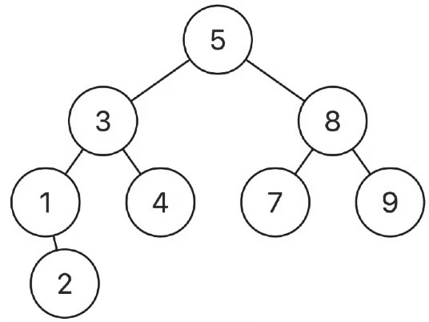

## 🔗 LeetCode Link  
[... - LeetCode](https://leetcode.com/problems/xxx)

## 🧾 Problem Description  
> Given a binary search tree (BST) where all node values are unique, and two nodes from the tree p and q, return the lowest common ancestor (LCA) of the two nodes.

> The lowest common ancestor between two nodes p and q is the lowest node in a tree T such that both p and q as descendants. The ancestor is allowed to be a descendant of itself.

- Example:
    - 
- Example 1
    - Input: root = [5,3,8,1,4,7,9,null,2], p = 3, q = 8; Output: 5

- Example 2
    - Input: root = [5,3,8,1,4,7,9,null,2], p = 3, q = 4; Output: 3
    - Explanation: The LCA of nodes 3 and 4 is 3, since a node can be a descendant of itself.

- Constraints:
    - 2 <= The number of nodes in the tree <= 100.
    - -100 <= Node.val <= 100
    - p != q
    - p and q will both exist in the BST.

- Recommended Time & Space Complexity
    - You should aim for a solution as good or better than O(h) time and O(h) space, where h is the height of the given tree.

> Hint 1: A Binary Search Tree (BST) is a tree in which the values of all nodes in the left subtree of a node are less than the node's value, and the values of all nodes in the right subtree are greater than the node's value. Additionally, every subtree of a BST must also satisfy this property, meaning the "less than" or "greater than" condition is valid for all nodes in the tree, not just the root. How can you use this idea to find the LCA of the given nodes in the tree?

> Hint 2: We can use recursion to traverse the tree. Can you figure out the conditions we encounter when choosing a path between the left and right subtrees during traversal using the values of the two given nodes? Perhaps you can determine the LCA by traversing based on these conditions.

> Hint 3: If nodes p and q are in different subtrees, a split occurs, making the current node the LCA. If both are in the left or right subtree, the LCA lies in that subtree and we further choose that subtree to traverse using recursion. You should also handle other multiple scenarios to get the LCA.

> Hint 4: The LCA can also be one of the nodes, p or q, if the current node is equal to either of them. This is because if we encounter either p or q during the traversal, that node is the LCA.
---


## 🧠 My Python Solution
```python
# Definition for a binary tree node.
# class TreeNode:
#     def __init__(self, val=0, left=None, right=None):
#         self.val = val
#         self.left = left
#         self.right = right

class Solution:
    # Helper function to find path from root to target node
    def find_path(self, node, target, path):
        if not node:
            return False
        
        path.append(node)

        if node.val == target.val:
            return True

        if self.find_path(node.left, target, path) or self.find_path(node.right, target, path):
            return True
        
        path.pop()
        return False

    def lowestCommonAncestor(self, root: TreeNode, p: TreeNode, q: TreeNode) -> TreeNode:
        path_p = []
        path_q = []

        found_p = self.find_path(root, p, path_p)
        found_q = self.find_path(root, q, path_q)

        if not found_p or not found_q:
            return None  # One of the nodes was not found in the tree

        i = 0
        while i < len(path_p) and i < len(path_q) and path_p[i] == path_q[i]:
            i += 1

        return path_p[i - 1]
```

## 💡 Thought Process
...