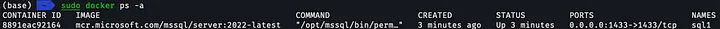
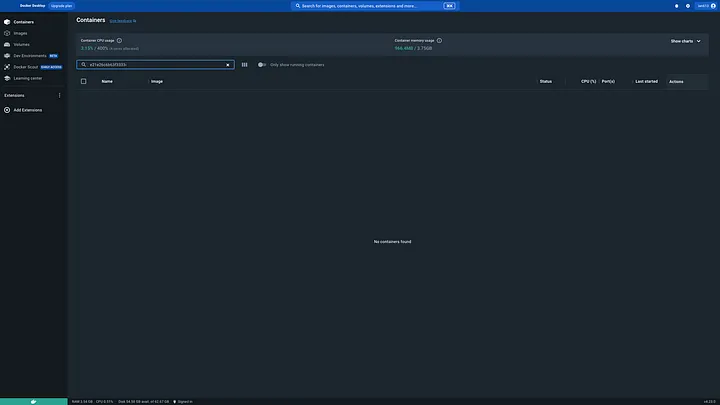
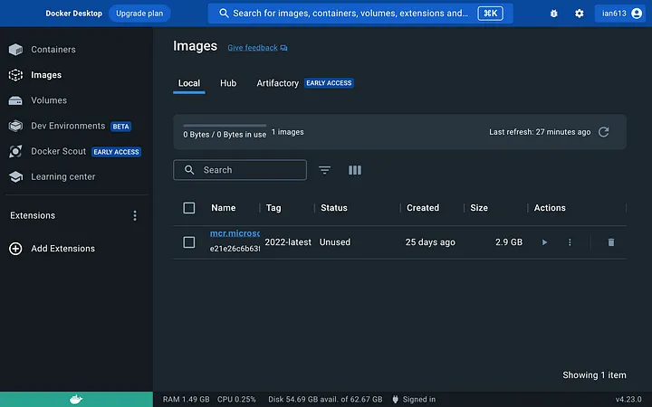
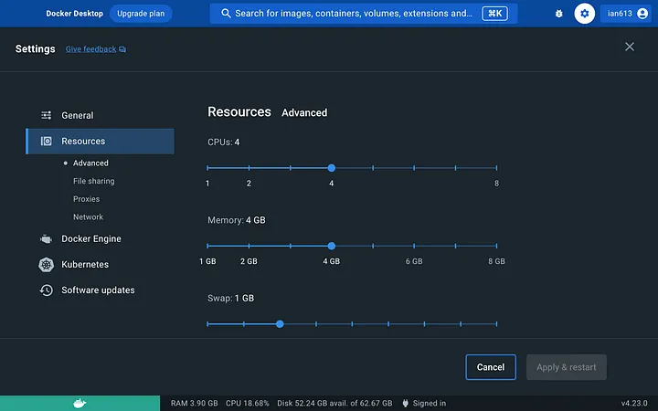

[Mac]透過Docker運行MSSQL
1. 到官網下載mac安裝包
Install Docker Desktop on Mac
Install Docker for Mac to get started. This guide covers system requirements, where to download, and instructions on…docs.docker.com
2. 開啟Docker軟體，登入後確認記憶體是否有開到4GB以上
3. Termial 下載MSSQL映像檔
sudo docker pull mcr.microsoft.com/mssql/server:2022-latest
4. 啟動Linux container image
sudo docker run -e "ACCEPT_EULA=Y" -e "MSSQL_SA_PASSWORD=<YourStrong@Passw0rd>" \
   -p 1433:1433 --name sql1 --hostname sql1 \
   -d \
   mcr.microsoft.com/mssql/server:2022-latest
完成後會在continers欄位看到"sql1"
5. 確認安裝成功
sudo docker ps -a
output6. 更改密碼
sudo docker exec -it sql1 /opt/mssql-tools/bin/sqlcmd \
-S localhost -U SA \
 -P "$(read -sp "Enter current SA password: "; echo "${REPLY}")" \
 -Q "ALTER LOGIN SA WITH PASSWORD=\"$(read -sp "Enter new SA password: "; echo "${REPLY}")\""
7. 連到SQL Server
sudo docker exec -it sql1 "bash"
連進SQL CMD
/opt/mssql-tools/bin/sqlcmd -S localhost -U SA -P "<YourNewStrong@Passw0rd>"
如果成功的話會看到 1>
References
Docker: Install containers for SQL Server on Linux - SQL Server
This quickstart shows how to use Docker to run the SQL Server Linux container images. You connect to a database and run…learn.microsoft.com
How to Install SQL Server Management Studio on a Mac
SQL Server Management Studio is a free Windows tool that allows you to access and manage all components of an SQL…builtin.com

