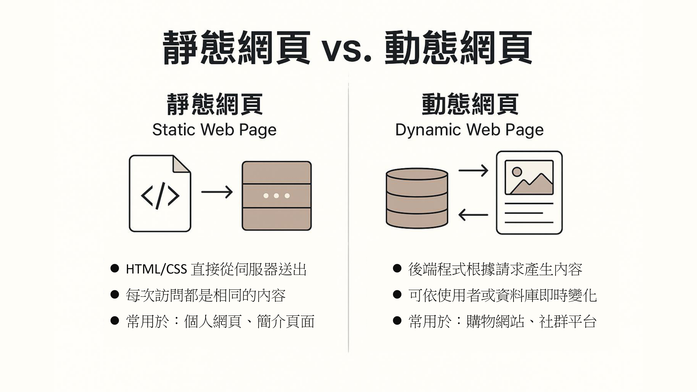
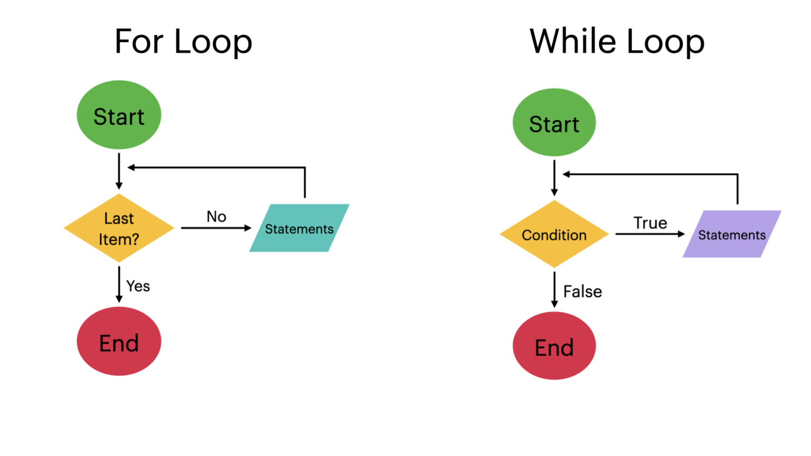
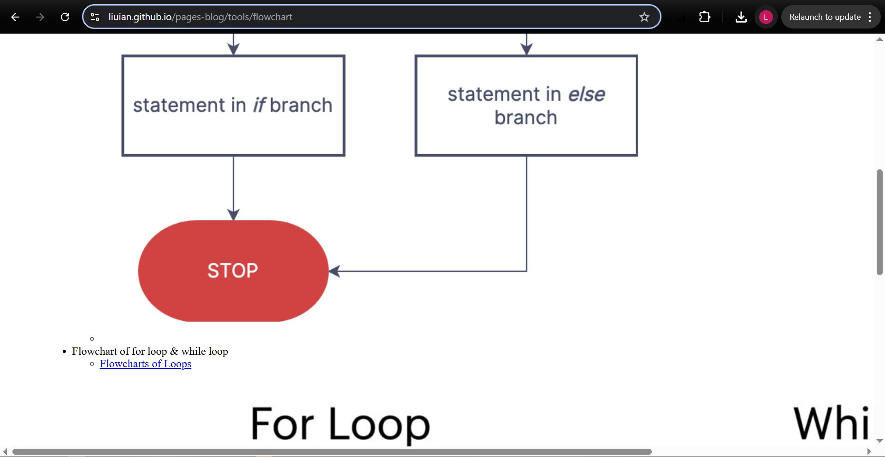
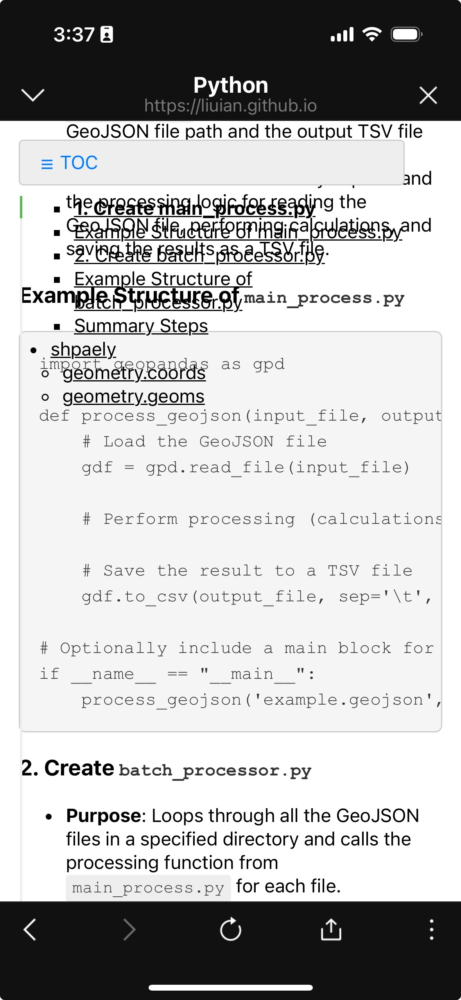

# 利用 Github Pages 免費架一個靜態網頁

## Step 0: 靜態網頁 vs. 動態網頁



## Step 1: 設定自動同步 readme.md & index.md 腳本

這種方式可以 **讓你只維護 `README.md`**，然後在每次 Git commit 前，自動產生對應的 `index.md` 作為 GitHub Pages 的首頁，非常適合開發者使用的 workflow 🚀

---

### ✅ 最終效果
每次你 `git commit` 前，Git 會：

1. 讀取 `README.md`
2. 在前面加上 Jekyll 的 front matter
3. 輸出成 `index.md` 給 GitHub Pages 使用

---

### 🔧 教學步驟：建立 Git pre-commit hook

#### 📁 步驟 1：建立 `.git/hooks/pre-commit` 檔案（或修改它）

- Note: 從檔案總管找到pro-commit檔案，又鍵用vs code打開。
- Note: `pre-commit`要設為`LF`檔，而不是`CRLF`。可以在vscode右下角設定。

在你的 repo 根目錄中，打開 terminal：

```bash
cd pages-med-utils/.git/hooks
nano pre-commit
```

或你可以用 VS Code/任何編輯器。

---

#### 📝 步驟 2：貼上以下腳本內容

```bash
#!/bin/bash

# 這是 pre-commit hook，自動從 README.md 生成 index.md（含 Jekyll front matter）

echo "---" > index.md
echo "layout: default" >> index.md
echo "title: Home" >> index.md
echo "---" >> index.md
echo "" >> index.md

cat README.md >> index.md

echo "[pre-commit] index.md has been updated from README.md"
```

> 🔁 你可以根據實際需要修改 layout 或其他 front matter。

---

#### 📛 步驟 3：賦予這個檔案執行權限

- 可以跳過這一步驟，直接用下一步驟測試是否ok。
```bash
chmod +x .git/hooks/pre-commit
```

- 用這個步驟測試
```bash
bash .git/hooks/pre-commit
[pre-commit] index.md has been updated from README.md
---

### 🧪 步驟 4：測試一下！

1. 編輯 `README.md`
2. 執行：

```bash
git add .
git commit -m "Update README"
```

你會看到：

```bash
[pre-commit] index.md has been updated from README.md
```

然後 `index.md` 也自動更新啦 🎉

---

### 🔄 額外升級（可選）
如果你要讓這段 hook 能跨機使用或分享給其他人，也可以放到 `.githooks/pre-commit` 並設一個 `core.hooksPath`：

```bash
mkdir .githooks
mv .git/hooks/pre-commit .githooks/pre-commit
git config core.hooksPath .githooks
```

## Step 2: 讓 markdown 檔案可以顯示在網頁上
### 簡易版本
- 在 markdown 檔案最上方加上

```markdown
---
layout: default
title: Home
---
```

## Step 3: 插入圖片
### 方法二：用 site.url 和 site.baseurl（比較通用）
`.md` 或 HTML 裡寫上絕對路徑：

```liquid

```

## Step 4: 進階設定
### 1. **新增 RSS 訂閱功能**透過加入 `jekyll-feed` 插件，讓讀者能訂閱你的部落格，獲得最新文章通知

**設定方法：**
在 `_config.yml` 中加入：
```yaml
plugins:
  - jekyll-feed
```

### 2. **啟用文章分類與標籤**使用 `jekyll-archives` 插件，將文章依照分類或標籤整理，方便讀者瀏覽特定主題的內容

**設定方法：**
在 `_config.yml` 中加入：
```yaml
plugins:
  - jekyll-archives
```

### 3. **新增搜尋功能**導入如 [Lunr.js](https://lunrjs.com/) 的搜尋功能，讓讀者能快速找到感興趣的文章

### 4. **建立「關於我」頁面**提供一個「關於我」頁面，介紹你的背景、專業領域或部落格的宗旨，增加讀者的信任感

---

### 📈 SEO 與社群分享優化

#### 5. **完善 SEO 設定*
使用 `jekyll-seo-tag` 插件，自動生成適當的 meta 標籤，提升搜尋引擎的收錄效。

**設定方法：**
在 `_config.yml` 中加入：
```yaml
plugins:
  - jekyll-seo-tag
```

並在你的佈局檔案（如 `_layouts/default.html`）的 `<head>` 區塊中加：
```html

```

#### 6. **新增網站地圖*
透過 `jekyll-sitemap` 插件，自動生成 sitemap.xml，幫助搜尋引擎更有效地索引你的網。

**設定方法：**
在 `_config.yml` 中加入：
```yaml
plugins:
  - jekyll-sitemap
```

#### 7. **整合社群分享功能*
加入社群分享按鈕，讓讀者能輕鬆分享文章至 Facebook、Twitter 等平台，擴大曝光。

---

### 🎨 使用者體驗與設計建議

#### 8. **優化行動裝置顯示*
確保網站在手機和平板上也有良好的顯示效果。你可以使用 [Google 的行動裝置友好測試工具](https://search.google.com/test/mobile-friendly) 來檢查並化。

#### 9. **自訂網站風格*
透過修改 `assets/css/style.scss`，自訂網站的配色、字體等風格，讓部落格更具個人色。

---

### 📊 進階功能建議

#### 10. **整合網站分析工**
使用 Google Analytics 或其他分析工具，了解讀者的瀏覽行為，進一步優化內容佈局。

#### 11. **啟用留言功**
透過整合 [Disqus](https://disqus.com/) 等第三方服務，讓讀者能在文章下方留言，增加動性。


## Step 5: 外觀 (加入側邊欄, 程式碼區塊方框)
### 5.1 加入側邊欄
所有頁面都自動帶有 **可折疊的目錄欄（TOC）**，需要 **修改 `_layouts/default.html`**，把 TOC 整合進每一頁的主架構。

#### 5.1.0 最終資料夾結構
```txt
IanBlog/
├── _layouts/
│   └── default.html               ← 加入 TOC 結構的主模板
├── assets/
│   ├── css/
│   │   └── style.scss            ← 高亮 TOC 的 CSS
│   └── js/
│       └── main.js               ← tocbot 的初始化腳本
│
├── index.md                      ← 首頁（含目錄導引）
├── README.md                     ← GitHub repo 說明（可選）
│
├── {文章資料夾1}/
│   └── {文章1}.md
├── {文章資料夾2}/
│   ├── {文章2}.md
└── {文章資料夾3}/
    └── {文章3}.md
```

#### 5.1.1 新增 `_layouts/default.html`

這邊是一個 **簡潔、通用的 layout 結構**，可以讓 TOC 固定在左側、內容在右側，自動作用於所有頁面：

```html
<!DOCTYPE html>
<html lang="en">
  <head>
    <meta charset="UTF-8">
    <title>{{ page.title }}</title>
    <meta name="viewport" content="width=device-width, initial-scale=1">

    <link rel="stylesheet" href="{{ '/assets/css/style.css' | relative_url }}">
    <link rel="stylesheet" href="https://cdn.jsdelivr.net/npm/tocbot@4.20.1/dist/tocbot.css">

     <!-- 如果有 jekyll-seo-tag -->
  </head>
  <body>
    <div style="display: flex; max-width: 1200px; margin: 0 auto; padding: 1rem;">
      
      <nav class="js-toc" style="width: 250px; margin-right: 2rem; position: sticky; top: 1rem;"></nav>

      <div class="js-toc-content" style="flex: 1;">
        {{ content }}
      </div>
    </div>

    <script src="https://cdn.jsdelivr.net/npm/tocbot@4.20.1/dist/tocbot.min.js"></script> <!-- TOC Script -->
    <script src="{{ '/assets/js/main.js' | relative_url }}"></script>   <!-- custom script -->

  </body>
</html>
```

#### Note:
- `<head>`: 用來定義網頁的元數據，設置頁面標題、字符編碼、樣式、SEO 信息等，這些對頁面本身不可見，但對頁面的加載和優化非常重要。
- `<body>`: 包含頁面的實際內容，這些內容會顯示在用戶的瀏覽器中。它包括頁面文本、圖片、導航欄、主內容等。

#### 5.1.2 新增 `assets/css/style.scss`

這樣可以讓目前閱讀區塊的目錄高亮顯示：

```scss
.is-active-link {
  font-weight: bold;
  color: #1a73e8;
}
```

#### 5.1.3 新增 `assets/js/main.js`
```js
tocbot.init({
  tocSelector: '.js-toc',
  contentSelector: '.js-toc-content',
  headingSelector: 'h1, h2, h3, h4, h5, h6',
  collapseDepth: 6,
  scrollSmooth: true,
  orderedList: false,
});
```

#### 5.1.4 最後檢查一下每個 `.md` 頁面都要有：

```markdown

---
layout: default
title: 任意標題
---

```

這樣才能套用我們剛剛改的 `default.html`！

### 5.2 解決插入sidebar後圖片變超大
- 現象: 
- 原因: 沒有限制圖片寬度
- 解法: 在 `assets/css/style.scss` 加入以下這段

```css
img {
    max-width: 100%;
    height: auto;
    display: block;
    margin: 1rem auto;
}
```

### 5.3 加入區塊程式碼方框(markdown)

```css
/* Style for code blocks (surrounded by triple backticks ```) */
pre {
  background: #f5f5f5;       /* Light gray background */
  border: 1px solid #ccc;    /* Gray border */
  border-radius: 6px;
  padding: 1rem;
  overflow-x: auto;          /* Enable horizontal scroll for overflow */
  font-family: Consolas, Monaco, 'Courier New', monospace;
  font-size: 0.95rem;
  line-height: 1.5;
}

/* Additional styling for code content */
code {
  font-family: Consolas, Monaco, 'Courier New', monospace;
  font-size: 0.95rem;
  color: #333;
}

/* Inline code styling (e.g. `example`) */
p code, li code {
  background-color: #eee;
  padding: 0.2em 0.4em;
  border-radius: 3px;
  font-size: 0.9em;
}
```

### 5.4 使的側邊欄可收合
要讓你的 **TOC 側邊欄可收合（可展開 / 收起）**，我們可以加上一些簡單的 JavaScript 搭配 CSS 切換 class，以下是完整解法：

#### ✅ 修改後的內容包括：

1. 為側邊欄加上 **切換按鈕**  
2. 增加 **`.collapsed` class 的 CSS 控制樣式**  
3. 加入 JavaScript 處理「收合 / 展開」行為

---

#### 5.4.1 **修改 `default.html`**

在 `<nav class="sidebar js-toc">` 外面包一個容器，加上一個按鈕：

```html
<!-- TOC 導覽欄容器 -->
<div class="sidebar-wrapper">
  <button id="toggle-sidebar">☰ Table of Contents</button>
  <nav class="sidebar js-toc"></nav>
</div>
```

`main.js` 改為：

```html
<script>
  // 初始化 TOCBOT
  tocbot.init({
    tocSelector: '.js-toc',
    contentSelector: '.js-toc-content',
    headingSelector: 'h1, h2, h3, h4, h5, h6',
    collapseDepth: 6,
    scrollSmooth: true,
    orderedList: false,
  });

  // 切換側邊欄顯示 / 隱藏
  document.getElementById('toggle-sidebar').addEventListener('click', function () {
    document.querySelector('.sidebar').classList.toggle('collapsed');
  });
</script>
```


#### 🎨 **修改 `style.css`**

```css
/* 包住 sidebar 與切換按鈕的外框 */
.sidebar-wrapper {
    display: flex;
    flex-direction: column;
    margin-right: 2rem;
    position: sticky;
    top: 1rem;
    align-self: flex-start;
}

/* 收合狀態下隱藏 TOC */
.sidebar.collapsed {
    display: none;
}

/* TOC 切換按鈕 */
#toggle-sidebar {
    background: #eee;
    border: 1px solid #ccc;
    padding: 0.5rem 1rem;
    margin-bottom: 0.5rem;
    border-radius: 4px;
    cursor: pointer;
    font-size: 1rem;
    text-align: left;
}

@media (max-width: 768px) {
    #toggle-sidebar {
    width: 100%;
    }
}
```

### 5.5 處理手機板TOC排版
- For example:


- 將style.css `@media` 部分改為
```css
/* Responsive */
@media (max-width: 768px) {
    .container {
        flex-direction: column;
        padding: 0.5rem;
    }

    .sidebar-wrapper {
        width: 100%;
        margin-right: 0;
        position: relative;
    }

    .sidebar {
        width: 100%;
        max-height: 60vh;
        overflow-y: auto;
        background: #fff;
        border: 1px solid #ccc;
        border-radius: 6px;
        box-shadow: 0 2px 6px rgba(0,0,0,0.1);
        margin-bottom: 1rem;
        padding: 1rem;
        z-index: 1;
    }

    .sidebar.collapsed {
        max-height: 0;
        overflow: hidden;
        padding: 0;
        border: none;
        box-shadow: none;
    }

    #toggle-sidebar {
        width: 100%;
        margin-bottom: 0.5rem;
        position: relative;
        z-index: 2;
        background: #f9f9f9;
        font-weight: bold;
    }

    .content {
        z-index: 0;
        position: relative;
    }
}
```

### 5.6 程式碼高亮
1. 新增 `assets/rouge.css`
2. 貼上 https://raw.githubusercontent.com/jwarby/jekyll-pygments-themes/master/github.css 內容
3. 加入到 `_layouts/default.html` <body> 部分

```html
<script src="{{ '/assets/js/main.js' | relative_url }}"></script>   <!-- custom script -->
```

### 5.7 加入 back to home & jump to top
1. `style.css`加入

```css
/* Back to home 連結 */
.back-home-link {
    position: fixed;
    bottom: 2rem;
    left: 1.5rem;
    background: #f0f0f0;
    color: #333;
    padding: 0.5rem 1rem;
    text-decoration: none;
    border: 1px solid #ccc;
    border-radius: 4px;
    z-index: 999;
    font-size: 0.9rem;
}


/* TOC 切換按鈕 */
#toggle-sidebar {
    background: #eee;
    border: 1px solid #ccc;
    padding: 0.5rem 1rem;
    margin-bottom: 0.5rem;
    border-radius: 4px;
    cursor: pointer;
    font-size: 1rem;
    text-align: left;
}
```

2. `main.js` 改為

```js
document.addEventListener("DOMContentLoaded", function () {
    // 初始化 tocbot
    tocbot.init({
        tocSelector: '.js-toc',
        contentSelector: '.js-toc-content',
        headingSelector: 'h1, h2, h3, h4, h5, h6',
        hasInnerContainers: true,
        collapseDepth: 6,
        scrollSmooth: true,
        orderedList: false,
    });

    // 切換 TOC 側邊欄顯示
    const toggleButton = document.getElementById("toggle-sidebar");
    const sidebar = document.querySelector(".sidebar");

    toggleButton.addEventListener("click", function () {
        sidebar.classList.toggle("collapsed");
    });

    // Jump to top 功能
    const toTopBtn = document.createElement("button");
    toTopBtn.textContent = "↑ Top";
    toTopBtn.className = "jump-top-btn";
    document.body.appendChild(toTopBtn);

    toTopBtn.addEventListener("click", function () {
        window.scrollTo({ top: 0, behavior: "smooth" });
    });

    // Back to home 功能（只有在不是首頁時顯示）
    if (window.location.pathname !== "/pages-blog/" && window.location.pathname !== "/pages-blog/index.html") {
        const backHomeLink = document.createElement("a");
        backHomeLink.textContent = "← Home";
        backHomeLink.href = "https://liuian.github.io/pages-blog/";
        backHomeLink.className = "back-home-link";
        document.body.appendChild(backHomeLink);
    }
    // 捲動到一定高度後顯示「Top」按鈕
    window.addEventListener("scroll", function () {
        if (window.scrollY > 300) {
            toTopBtn.style.display = "block";
        } else {
            toTopBtn.style.display = "none";
        }
    });
});
```


### 5.8 TOC 客製化自動捲動方式　
TODO

## Note - debug 
### 如果 deployment 卡住
- 強制重新deploy

```bash
git commit --amend --no-edit
git push origin main --force
```