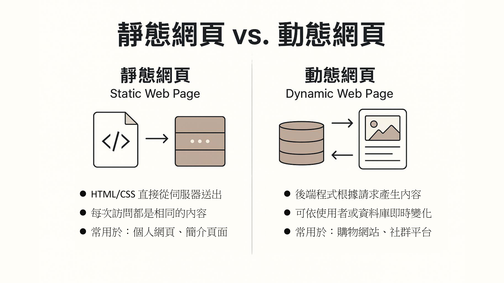

# 利用 Github Pages 免費架一個靜態網頁

## Step 0: 靜態網頁 vs. 動態網頁


## Step 1: 設定自動同步 readme.md & index.md 腳本

這種方式可以 **讓你只維護 `README.md`**，然後在每次 Git commit 前，自動產生對應的 `index.md` 作為 GitHub Pages 的首頁，非常適合開發者使用的 workflow 🚀

---
### ✅ 最終效果
每次你 `git commit` 前，Git 會：

1. 讀取 `README.md`
2. 在前面加上 Jekyll 的 front matter
3. 輸出成 `index.md` 給 GitHub Pages 使用
---

### 🔧 教學步驟：建立 Git pre-commit hook

#### 📁 步驟 1：建立 `.git/hooks/pre-commit` 檔案（或修改它）

- Note: 從檔案總管找到pro-commit檔案，又鍵用vs code打開。
- Note: `pre-commit`要設為`LF`檔，而不是`CRLF`。可以在vscode右下角設定。

在你的 repo 根目錄中，打開 terminal：

```bash
cd pages-med-utils/.git/hooks
nano pre-commit
```

或你可以用 VS Code/任何編輯器。

---

#### 📝 步驟 2：貼上以下腳本內容

```bash
#!/bin/bash

# 這是 pre-commit hook，自動從 README.md 生成 index.md（含 Jekyll front matter）

echo "---" > index.md
echo "layout: default" >> index.md
echo "title: Home" >> index.md
echo "---" >> index.md
echo "" >> index.md

cat README.md >> index.md

echo "[pre-commit] index.md has been updated from README.md"
```

> 🔁 你可以根據實際需要修改 layout 或其他 front matter。

---

#### 📛 步驟 3：賦予這個檔案執行權限

- 可以跳過這一步驟，直接用下一步驟測試是否ok。
```bash
chmod +x .git/hooks/pre-commit
```

- 用這個步驟測試
```bash
bash .git/hooks/pre-commit
[pre-commit] index.md has been updated from README.md
---

### 🧪 步驟 4：測試一下！

1. 編輯 `README.md`
2. 執行：

```bash
git add .
git commit -m "Update README"
```

你會看到：

```bash
[pre-commit] index.md has been updated from README.md
```

然後 `index.md` 也自動更新啦 🎉

---

### 🔄 額外升級（可選）
如果你要讓這段 hook 能跨機使用或分享給其他人，也可以放到 `.githooks/pre-commit` 並設一個 `core.hooksPath`：

```bash
mkdir .githooks
mv .git/hooks/pre-commit .githooks/pre-commit
git config core.hooksPath .githooks
```

## Step 2: 讓 markdown 檔案可以顯示在網頁上
### 簡易版本
- 在 markdown 檔案最上方加上

```markdown
---
layout: default
title: Home
---
```

## Step 3: 插入圖片
### 方法二：用 site.url 和 site.baseurl（比較通用）

你可以在 `_config.yml` 裡加上：

```yaml
baseurl: "/pages-blog"
```

然後在你的 `.md` 或 HTML 裡寫：

```liquid

```

這樣無論你網站部署在哪個路徑（子資料夾），都會顯示正確！

## Note: 如果 deployment 卡住
```bash
git commit --amend --no-edit
git push origin main --force
```