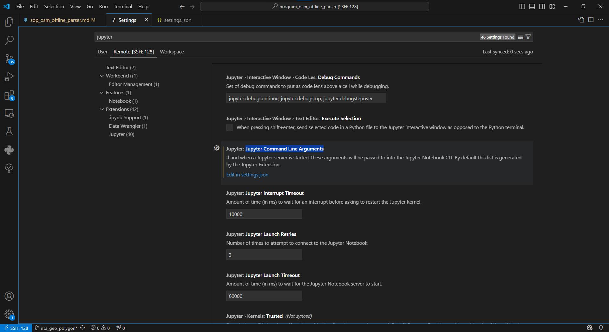

# short key
- 從某一位置一次選取多行: `Alt + Shift`

# VS Code Python Tool Does Multiple Interactive Windows
- [VS Code Python Tool Does Multiple Interactive Windows](https://visualstudiomagazine.com/articles/2020/08/13/vs-code-python.aspx)
- Just open the settings page (File > Preferences > Settings), search for `interactive window mode` and change the setting value to `perFile`. Now when you run cells from different files, they will each run on their own separate window."

# remote ssh
1. install extension in vscode
    - install remote ssh, it will also install other two extension
    - 

2. Set Up SSH Configuration
    - Open the Command Palette by pressing `Ctrl + Shift + P` and type `Remote-SSH: Open Configuration File`.
    - Select the SSH configuration file to edit (usually ~/.ssh/config).
    - 
3. Connect to the Remote Server
    - Open the Command Palette again (`Ctrl + Shift + P`) and type `Remote-SSH: Connect to Host`.
    - Select the my_remote_server entry (or whatever name you used).
    - VS Code will connect to the remote server and open a new window.
    - 
4. Select Miniconda Python Environment
    - After connecting to the remote server, press `Ctrl + Shift + P` again and search for `Python: Select Interpreter`.

- TODO: 查這個jupyter是怎麼連上server的，port是多少，config是哪個檔案

# vscode-pandoc
- https://marketplace.visualstudio.com/items?itemName=DougFinke.vscode-pandoc
- https://github.com/jgm/pandoc/releases/tag/3.5
1. download `pandoc-3.5-windows-x86_64.msi`
2. install
3. press `F1` search `pandoc rendor`, and press document type wanted
- note that there should not have word file opened in the computer, or will show error

# Jupyter enviromnent
1. 打开 VS Code 设置： Windows/Linux: `Ctrl + ,`
2. 搜索 `Jupyter Command Line Arguments`
3. click `edit in settings.json`
    - 
4. add arguments - `"--port=8886"`
    ```json
    {
        "python.defaultInterpreterPath": "/home/covmo/miniconda3/envs/py36_gis/bin/python",
        "jupyter.jupyterCommandLineArguments": [    
            "--port=8886"
        ],
        "jupyter.allowUnauthorizedRemoteConnection": true
    }
    ```
5. search current jupyter notebook list
    ```bash
    $ jupyter notebook list
    Currently running servers:
    http://192.168.1.128:9876/ :: /home/covmo/jupyter_data
    http://192.168.1.128:8886/ :: /home/covmo
    http://192.168.1.128:8888/ :: /data/tmp/sheldon/dem/salt/mapbox
    ```

# 設定預覽模式
在 VSCode 中，你可以設定「**點擊一次預覽、點擊兩次才固定開啟檔案**」的行為，這功能叫做 **預覽模式（Preview Mode）**。若你想要 **點一下只預覽，點兩下才固定打開**（避免每次點檔案都開太多 tab），請依照下列步驟設定：

1. 打開 VSCode。
2. 點左下角齒輪 → 選「**設定**」。
3. 搜尋 `workbench.editor.enablePreview`
4. 勾選 ✅「**Workbench › Editor: Enable Preview**」  
   - 開啟後：點一下檔案是「預覽」，點兩下才「固定」這個檔案。
   - 關閉後：每次點檔案都會新開一個 tab。

